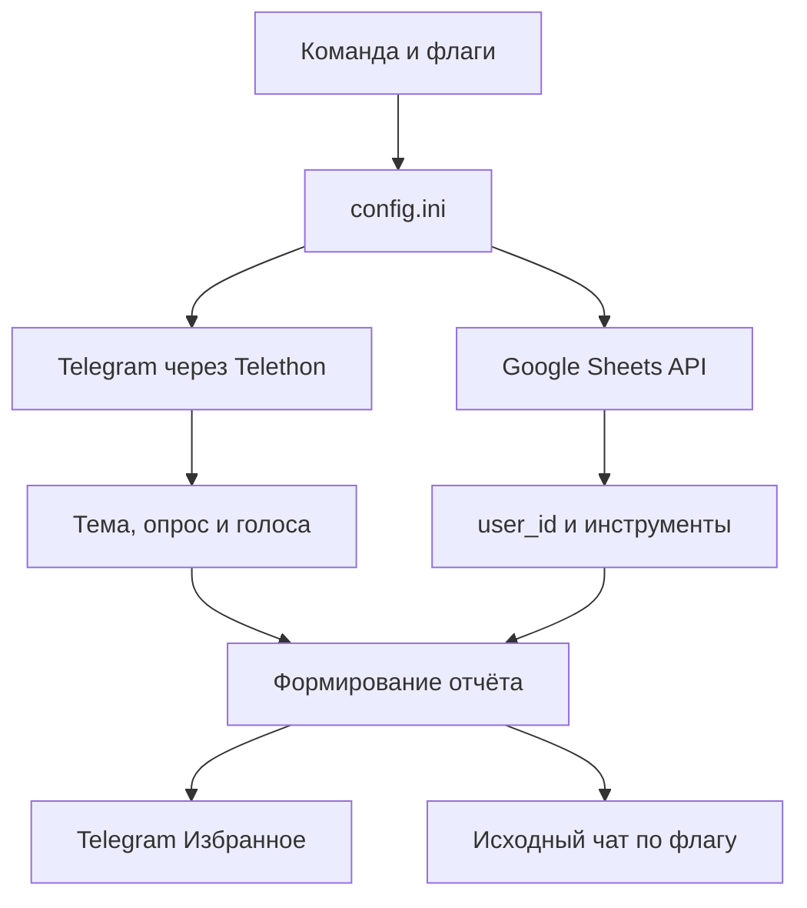

# The Eye Of Sauron 🎻

**The Eye Of Sauron** — консольная программа для учёта состава оркестра по
результатам Telegram-опросов.

Программа находит опрос о репетиции, концерте или другом мероприятии, получает
список пользователей, выбравших положительные варианты ответа, сопоставляет их
Telegram ID с базой музыкантов в Google Sheets, группирует участников по
инструментам, рассчитывает количество пультов и отправляет готовый отчёт в
Telegram.

Текущая версия: **2.2.0**.

> Проект использует пользовательский Telegram-аккаунт через Telethon, а не
> Telegram-бота. Для чтения списка проголосовавших аккаунт должен иметь доступ к
> чату и опросу.

## Содержание

- [Что умеет программа](#что-умеет-программа)
- [Как работает программа](#как-работает-программа)
- [Системные требования](#системные-требования)
- [Быстрый запуск уже настроенного проекта](#быстрый-запуск-уже-настроенного-проекта)
- [Установка на Android в Termux](#установка-на-android-в-termux)
- [Установка на Linux и macOS](#установка-на-linux-и-macos)
- [Установка на Windows](#установка-на-windows)
- [Настройка Telegram](#настройка-telegram)
- [Настройка Google Sheets](#настройка-google-sheets)
- [Настройка config.ini](#настройка-configini)
- [База музыкантов](#база-музыкантов)
- [Синхронизация участников](#синхронизация-участников)
- [Запуск основного парсера](#запуск-основного-парсера)
- [Все аргументы командной строки](#все-аргументы-командной-строки)
- [Как выбираются чат, тема и опрос](#как-выбираются-чат-тема-и-опрос)
- [Как определяются положительные ответы](#как-определяются-положительные-ответы)
- [Как формируется отчёт](#как-формируется-отчёт)
- [Подсчёт пультов](#подсчёт-пультов)
- [Безопасное хранение секретов](#безопасное-хранение-секретов)
- [Обновление проекта через Git](#обновление-проекта-через-git)
- [Проверка и тестирование](#проверка-и-тестирование)
- [Типичные ошибки](#типичные-ошибки)
- [Структура и архитектура проекта](#структура-и-архитектура-проекта)
- [Ограничения](#ограничения)

## Что умеет программа

Основной парсер умеет:

- подключаться к Telegram через Telethon;
- работать от имени обычного Telegram-аккаунта;
- использовать чат из `config.ini` или временно выбрать другой чат;
- принимать ID чата, `@username` или Telegram-ссылку;
- интерактивно выбирать чат из списка диалогов;
- показывать темы Telegram-форума;
- искать опрос внутри конкретной темы;
- искать опрос по части его вопроса;
- проверять закреплённый опрос при поиске по всему чату;
- при необходимости повторять поиск без ограничения по теме;
- учитывать сразу несколько положительных вариантов ответа;
- исключать очевидные отрицательные ответы вроде `Не смогу`;
- объединять проголосовавших из нескольких положительных вариантов без
  дубликатов;
- получать все страницы списка голосов;
- загружать инструменты музыкантов из Google Sheets;
- группировать музыкантов по оркестровым группам;
- рассчитывать количество пультов;
- отдельно показывать количество проголосовавших, которых нет в базе;
- всегда отправлять отчёт в Telegram «Избранное»;
- по флагу отправлять тот же отчёт в исходный чат ответом на опрос;
- прикладывать изображение `assets/TheEye.jpg`, если файл существует.

Вспомогательная команда синхронизации умеет:

- получить список участников настроенного Telegram-чата;
- создать заголовки в пустом листе Google Sheets;
- добавить новых участников в таблицу;
- обновить имя, фамилию и username существующих участников;
- сохранить вручную назначенный инструмент;
- записать время последнего обновления;
- не удалять строки участников, которых сейчас нет в Telegram-чате.

## Как работает программа

Общий поток данных выглядит так:



При обычном запуске программа выполняет следующие шаги:

1. Разбирает аргументы командной строки.
2. Загружает `config.ini` или другой файл, переданный через `--config`.
3. Создаёт Telethon-клиент и подключается к Telegram.
4. Определяет чат: из `config.ini`, из `--chat` или через `--pick-chat`.
5. Определяет тему Telegram-форума.
6. Ищет подходящие опросы.
7. Выбирает нужный опрос.
8. Находит все положительные варианты ответа.
9. Постранично получает проголосовавших за каждый такой вариант.
10. Объединяет Telegram ID проголосовавших в одно множество.
11. Авторизуется в Google через Service Account.
12. Загружает из листа Google Sheets соответствие `user_id → Инструмент`.
13. Сопоставляет Telegram ID с базой музыкантов.
14. Нормализует названия инструментов и считает состав.
15. Рассчитывает количество пультов.
16. Отправляет изображение и отчёт в «Избранное».
17. При наличии `--send-to-chat` отправляет их также в исходный чат.
18. Корректно отключается от Telegram даже при досрочном завершении.

## Системные требования

- Python **3.10 или новее**;
- доступ в интернет;
- Telegram-аккаунт;
- доступ этого аккаунта к нужному чату и опросу;
- Google-аккаунт с возможностью создать Service Account;
- Google Sheets API, включённый в Google Cloud Project;
- таблица Google Sheets, открытая Service Account на редактирование.

Основные зависимости закреплены в `pyproject.toml` и `requirements.txt`:

| Пакет | Версия | Назначение |
| --- | ---: | --- |
| `Telethon` | `1.42.0` | Работа с Telegram API |
| `google-auth` | `2.40.3` | Авторизация Google Service Account |
| `requests` | `2.32.5` | HTTP-запросы к Google Sheets REST API |
| `tzdata` | `2025.3` | База часовых поясов для Python |

В проекте **не используются** `gspread`, `oauth2client`, `numpy` и
`cryptography`. Работа с таблицей реализована небольшим REST-клиентом поверх
официального `google-auth`.

## Быстрый запуск уже настроенного проекта

Если проект уже установлен, `config.ini`, Service Account и Telegram-сессия
настроены, достаточно выполнить:

```bash
cd ~/repos/TheEyeOfSauron
source .venv/bin/activate
python -m eye
```

На Windows PowerShell:

```powershell
cd D:\path\to\TheEyeOfSauron
.\.venv\Scripts\Activate.ps1
python -m eye
```

Полная справка по флагам:

```bash
python -m eye --help
```

## Установка на Android в Termux

### Важные правила

1. Не копируйте на Android папку `.venv`, созданную в Windows или Linux.
2. Создавайте виртуальное окружение заново непосредственно в Termux.
3. Храните рабочий проект в домашнем каталоге Termux, например
   `~/repos/TheEyeOfSauron`.
4. Не запускайте проект непосредственно из `/storage/emulated/0` или
   `~/storage/shared`: на общей памяти Android могут не работать права на
   исполнение, символические ссылки и виртуальное окружение.
5. Не обновляйте `pip` командой `pip install --upgrade pip`: Termux управляет
   им через свой пакетный менеджер.

### Установка системных пакетов

```bash
pkg update
pkg install python python-pip python-ensurepip-wheels git
```

Проверка Python:

```bash
python --version
python -m pip --version
```

### Вариант 1: клонирование через Git

```bash
mkdir -p ~/repos
cd ~/repos
git clone --branch develop https://github.com/DrDowellsHead/TheEyeOfSauron.git
cd TheEyeOfSauron
```

Если репозиторий закрытый, GitHub запросит настроенную авторизацию. Можно также
использовать SSH-адрес репозитория после добавления SSH-ключа в GitHub.

### Вариант 2: проект получен архивом

Сначала разрешите Termux доступ к общей памяти Android:

```bash
termux-setup-storage
```

Установите `unzip`, создайте рабочий каталог и распакуйте архив:

```bash
pkg install unzip
mkdir -p ~/repos
cd ~/repos
unzip ~/storage/downloads/TheEyeOfSauron.zip
cd TheEyeOfSauron
```

Если архив уже распакован в папку `Download/TheEyeOfSauron`:

```bash
mkdir -p ~/repos
cp -r ~/storage/downloads/TheEyeOfSauron ~/repos/
cd ~/repos/TheEyeOfSauron
```

После копирования удалите только несовместимую `.venv`, если она приехала с
другого устройства:

```bash
rm -rf ~/repos/TheEyeOfSauron/.venv
```

Команда выше намеренно указывает точный каталог `.venv` внутри проекта. Не
сокращайте путь до неопределённой переменной и не удаляйте весь проект.

### Установка Python-пакета

В корне проекта запустите:

```bash
bash install_termux.sh
```

Установщик:

1. проверит наличие Python;
2. обнаружит несовместимую `.venv`, скопированную с Windows;
3. создаст или обновит локальное окружение `.venv`;
4. установит `setuptools`;
5. установит проект в editable-режиме;
6. установит зависимости из `pyproject.toml`;
7. проверит импорты `eye`, `google.auth`, `requests` и `telethon`.

Активируйте окружение:

```bash
source .venv/bin/activate
```

Проверка установки:

```bash
python -m eye --help
python -c "import eye, google.auth, requests, telethon; print('Импорты работают')"
```

После активации в начале приглашения Termux обычно отображается `(.venv)`.

## Установка на Linux и macOS

Перейдите в корень проекта и выполните:

```bash
python3 -m venv .venv
source .venv/bin/activate
python -m pip install --upgrade pip setuptools
python -m pip install --no-build-isolation -e .
```

Проверка:

```bash
python -m eye --help
```

Если в Linux отсутствует модуль `venv`, установите пакет для своего
дистрибутива, например в Debian/Ubuntu:

```bash
sudo apt update
sudo apt install python3 python3-venv python3-pip
```

## Установка на Windows

Откройте PowerShell в корне проекта:

```powershell
python -m venv .venv
.\.venv\Scripts\Activate.ps1
python -m pip install --upgrade pip setuptools
python -m pip install --no-build-isolation -e .
python -m eye --help
```

Если PowerShell запрещает активацию скриптов, разрешите её только для текущего
окна:

```powershell
Set-ExecutionPolicy -Scope Process -ExecutionPolicy Bypass
.\.venv\Scripts\Activate.ps1
```

Альтернативная активация в обычном `cmd.exe`:

```bat
.venv\Scripts\activate.bat
```

## Настройка Telegram

### Получение API ID и API Hash

Telethon подключается к Telegram от имени пользователя. Для этого нужны
собственные `api_id` и `api_hash`.

1. Откройте [my.telegram.org](https://my.telegram.org/).
2. Войдите по номеру телефона Telegram.
3. Откройте раздел **API development tools**.
4. Создайте приложение, если оно ещё не создано.
5. Скопируйте `api_id` и `api_hash` в `config.ini`.

Не публикуйте `api_hash` и не добавляйте заполненный `config.ini` в Git.

### Первый вход

При первом запуске Telethon может запросить:

- номер телефона;
- код подтверждения из Telegram;
- пароль облачной двухфакторной аутентификации, если он включён.

После успешного входа рядом с проектом создаётся файл сессии, например:

```text
orchestra_parser.session
```

Благодаря этому повторные запуски обычно не требуют нового кода подтверждения.
Файл сессии даёт доступ к авторизованному Telegram-сеансу, поэтому его нельзя
публиковать, отправлять посторонним или добавлять в Git.

### Доступ аккаунта

Используемый аккаунт должен:

- состоять в нужном чате или иметь доступ к нему;
- видеть нужную тему и опрос;
- иметь возможность просматривать список участников для синхронизации;
- иметь возможность просматривать голоса в неанонимном опросе;
- иметь право отправлять сообщения в чат при использовании `--send-to-chat`.

Telegram иногда разрешает смотреть список голосов только после того, как
аккаунт сам проголосовал. Программа распознаёт такую ситуацию и выводит
соответствующее сообщение.

### Как узнать chat_id

Самый простой способ — интерактивный выбор:

```bash
python -m eye --pick-chat
```

Программа покажет диалоги с номерами и ID. Найдите нужный чат и перенесите его
ID в `config.ini`:

```ini
chat_id = -1001234567890
```

В `config.ini` значение `chat_id` должно быть целым числом. `@username` и ссылки
поддерживаются флагом `--chat`, но не полем `chat_id`, потому что загрузчик
конфигурации преобразует его в `int`.

## Настройка Google Sheets

Программа обращается к Google Sheets REST API напрямую. Авторизация выполняется
через Service Account и официальный пакет `google-auth`.

### Создание Service Account

Общий порядок настройки:

1. Откройте [Google Cloud Console](https://console.cloud.google.com/).
2. Создайте новый проект или выберите существующий.
3. Включите для проекта **Google Sheets API**.
4. Откройте раздел учётных данных и создайте **Service Account**.
5. Откройте созданный Service Account.
6. Создайте для него новый ключ типа **JSON**.
7. Скачайте JSON-файл.
8. Поместите его в каталог `credentials` под именем
   `google_service_account.json` или укажите другой путь в `config.ini`.

Ожидаемый путь по умолчанию:

```text
credentials/google_service_account.json
```

### Предоставление доступа к таблице

Откройте JSON-ключ и найдите поле `client_email`. Оно выглядит примерно так:

```text
service-account-name@project-name.iam.gserviceaccount.com
```

Откройте Google-таблицу, нажмите **Настройки доступа** и добавьте этот адрес с
правами редактора. Открывать таблицу для всех по ссылке не требуется.

Если Service Account не добавлен в таблицу, Google обычно вернёт ошибку доступа
`403` или сообщение о недостаточных правах.

### Spreadsheet ID

ID таблицы находится в её URL:

```text
https://docs.google.com/spreadsheets/d/SPREADSHEET_ID/edit
```

Скопируйте только часть между `/d/` и `/edit`:

```ini
spreadsheet_id = SPREADSHEET_ID
```

### Название листа

`worksheet_name` — это название вкладки в нижней части Google Sheets, а не
название всего файла.

Например:

```ini
worksheet_name = Musicians
```

Название чувствительно к пробелам и должно полностью совпадать с вкладкой.
REST-клиент корректно экранирует пробелы и апострофы в названии.

### Проверка Google Sheets

После настройки выполните из корня проекта:

```bash
python test_google_sheets.py
```

При успешном подключении программа выведет:

```text
✅ Подключение к Google Sheets работает
Количество записей: N
```

Этот тест выполняет реальный запрос к Google и читает диапазон `A:F`, но не
изменяет таблицу.

## Настройка config.ini

Создайте рабочий файл из шаблона.

Linux, macOS и Termux:

```bash
cp config.example.ini config.ini
```

Windows PowerShell:

```powershell
Copy-Item config.example.ini config.ini
```

Полный пример:

```ini
[telegram]
api_id = 12345678
api_hash = 0123456789abcdef0123456789abcdef
session_name = orchestra_parser
chat_id = -1001234567890
default_topic_id = 0

[google_sheets]
credentials_file = credentials/google_service_account.json
spreadsheet_id = 1AbCdEfGhIjKlMnOpQrStUvWxYz
worksheet_name = Musicians

[search]
search_limit = 300
votes_page_size = 100
```

### Все параметры конфигурации

| Раздел | Параметр | Тип | Обязателен | Значение по умолчанию | Назначение |
| --- | --- | --- | --- | --- | --- |
| `telegram` | `api_id` | целое число | да | — | Telegram API ID |
| `telegram` | `api_hash` | строка | да | — | Telegram API Hash |
| `telegram` | `session_name` | строка | нет | `orchestra_parser` | Имя файла Telethon-сессии |
| `telegram` | `chat_id` | целое число | да | — | Основной Telegram-чат |
| `telegram` | `default_topic_id` | целое число | нет | `0` | Тема по умолчанию; `0` означает весь чат |
| `google_sheets` | `credentials_file` | путь | да | — | JSON-ключ Service Account |
| `google_sheets` | `spreadsheet_id` | строка | да | — | ID Google-таблицы |
| `google_sheets` | `worksheet_name` | строка | да | — | Название вкладки таблицы |
| `search` | `search_limit` | целое число | нет | `300` | Сколько последних сообщений просматривать |
| `search` | `votes_page_size` | целое число | нет | `100` | Размер страницы при загрузке голосов |

Относительный путь `credentials_file` вычисляется относительно текущего
рабочего каталога, а не относительно расположения `config.ini`. Поэтому
рекомендуется запускать команды из корня проекта:

```bash
cd ~/repos/TheEyeOfSauron
python -m eye
```

Основной парсер поддерживает другой конфигурационный файл через `--config`:

```bash
python -m eye --config configs/concert.ini
```

Команда `eye-sync-users` всегда читает `config.ini` из текущего каталога и пока
не имеет собственного флага `--config`.

## База музыкантов

В роли базы данных используется один лист Google Sheets. Это не реляционная
СУБД: программа работает с фиксированным диапазоном столбцов `A:F`.

Первая строка должна содержать заголовки **строго в таком порядке**:

| Столбец | Заголовок | Кто изменяет | Назначение |
| ---: | --- | --- | --- |
| A | `user_id` | программа | Числовой Telegram ID пользователя |
| B | `first_name` | программа | Имя из Telegram |
| C | `last_name` | программа | Фамилия из Telegram |
| D | `username` | программа | Username без `@` |
| E | `Инструмент` | человек | Инструмент или оркестровая группа |
| F | `Обновлено` | программа | Дата и время последней синхронизации |

Пример:

| user_id | first_name | last_name | username | Инструмент | Обновлено |
| ---: | --- | --- | --- | --- | --- |
| 123456789 | Иван | Иванов | ivan_violin | первые скрипки | 2026-09-04 12:30 |
| 987654321 | Анна | Петрова | anna_flute | флейта | 2026-09-04 12:30 |

### Требования к таблице

- Заголовки должны находиться в первой строке.
- Регистр и язык заголовков имеют значение.
- `Инструмент` и `Обновлено` написаны кириллицей.
- Не переставляйте столбцы: синхронизация записывает данные в `A:F` в указанном
  порядке.
- Не используйте объединённые ячейки внутри рабочего диапазона.
- Желательно не создавать несколько строк с одинаковым `user_id`.
- Дополнительные столбцы можно размещать справа от `F`, но программа их не
  читает и не обновляет.

Если лист полностью пуст, `eye-sync-users` автоматически создаст заголовки
`A1:F1` и затем добавит участников.

Если первая строка существует, но в ней отсутствует хотя бы один обязательный
заголовок, программа завершится с сообщением:

```text
В первой строке таблицы отсутствуют столбцы: ...
```

### Поле «Инструмент»

Инструмент назначается вручную ответственным за базу. Синхронизация намеренно
не изменяет столбец `Инструмент` у существующих пользователей.

Поддерживаемые стандартные категории:

- первые скрипки;
- вторые скрипки;
- альт;
- виолончель;
- контрабас;
- флейта;
- гобой;
- кларнет;
- фагот;
- саксофон;
- сопрано-саксофон;
- альт-саксофон;
- тенор-саксофон;
- баритон-саксофон;
- бас-саксофон;
- валторна;
- труба;
- тромбон;
- туба;
- ударные;
- фортепиано;
- арфа;
- дирижёр.

Нормализатор распознаёт распространённые части слов. Например:

| Значение в таблице | Категория отчёта |
| --- | --- |
| `Скрипка 1`, `1 скрипки` | первые скрипки |
| `Скрипка 2`, `2 скрипки` | вторые скрипки |
| `альты` | альт |
| `виолончели` | виолончель |
| `перкуссия` | ударные |
| `пианино` | фортепиано |
| `тенор саксофон` | тенор-саксофон |

Для предсказуемого отчёта используйте одну из поддерживаемых категорий. Пустое
значение относится к категории `неизвестно`. Произвольное название, которого
нет в поддерживаемом списке, может не попасть в стандартный порядок отчёта.

### Как связываются Telegram и Google Sheets

Единственным ключом сопоставления является числовой `user_id`.

- Имя, фамилия и username не используются для поиска соответствия.
- Смена username не ломает связь с музыкантом.
- Если пользователь проголосовал, но его `user_id` отсутствует в таблице, он
  попадёт в число `Не найдено в базе`.
- Если `user_id` в таблице пустой или не преобразуется в целое число, такая
  строка игнорируется при построении отчёта.

## Синхронизация участников

Основная команда:

```bash
eye-sync-users
```

Эквивалентный запуск модуля:

```bash
python -m eye.sync_users
```

Старый путь сохранён как совместимая обёртка:

```bash
python get_id/get_id.py
```

Перед запуском активируйте `.venv` и перейдите в корень проекта.

### Алгоритм синхронизации

1. Загружается `config.ini`.
2. Выполняется вход в Telegram через указанную сессию.
3. Открывается чат из `telegram.chat_id`.
4. Загружается полный доступный список участников через
   `iter_participants()`.
5. Для каждого участника собираются:
   - числовой ID;
   - имя;
   - фамилия;
   - username.
6. Выполняется подключение к Google Sheets.
7. Читаются существующие строки `A:F`.
8. Если таблица пустая, создаётся строка заголовков.
9. Для существующих `user_id` обновляются столбцы A–D и F.
10. Значение столбца E (`Инструмент`) сохраняется.
11. Новые пользователи добавляются в конец таблицы с пустым инструментом.

### Что синхронизация не делает

- не назначает инструменты автоматически;
- не удаляет строки отсутствующих участников;
- не очищает старые записи;
- не объединяет дубликаты `user_id`;
- не меняет данные правее столбца F;
- не читает `--chat` и другие флаги основного парсера;
- не принимает альтернативный `--config`.

Если пользователь покинул Telegram-чат, его строка останется в Google Sheets.
Это защищает вручную внесённый инструмент и историю базы. При необходимости
устаревшие строки удаляются вручную.

Во время большой синхронизации программа выводит прогресс через каждые 200
полученных участников.

## Запуск основного парсера

Перед каждым запуском:

```bash
cd ~/repos/TheEyeOfSauron
source .venv/bin/activate
```

Основная команда:

```bash
python -m eye
```

После установки доступны также консольные команды:

```bash
eye-of-sauron
eye-sync-users
```

`python -m eye` и `eye-of-sauron` запускают один и тот же основной парсер.

### Примеры

Обычный запуск с настройками из `config.ini`:

```bash
python -m eye
```

Показать темы основного чата:

```bash
python -m eye --list-topics
```

Искать только в теме с ID `4`:

```bash
python -m eye --topic-id 4
```

Искать по всему чату:

```bash
python -m eye --topic-id 0
```

Найти тему по части названия:

```bash
python -m eye --topic "репетиция"
```

Найти опрос по части вопроса:

```bash
python -m eye --poll "Бал в Атриуме"
```

Временно использовать другой чат:

```bash
python -m eye --chat -1001234567890
python -m eye --chat @orchestra_chat
python -m eye --chat "https://t.me/orchestra_chat"
```

Интерактивно выбрать чат:

```bash
python -m eye --pick-chat
```

Отправить результат и в «Избранное», и в исходный чат:

```bash
python -m eye --send-to-chat
```

Использовать нестандартные положительные ответы:

```bash
python -m eye --yes "участвую" --yes "буду к 19:00"
```

Комбинация нескольких параметров:

```bash
python -m eye \
  --chat @orchestra_chat \
  --topic "концерты" \
  --poll "Бал в Атриуме" \
  --yes "смогу,приеду,✅" \
  --smart-sort \
  --send-to-chat
```

## Все аргументы командной строки

| Аргумент | Значение | По умолчанию | Назначение |
| --- | --- | --- | --- |
| `-h`, `--help` | нет | — | Показать справку и завершить работу |
| `--config` | путь | `config.ini` | Использовать другой INI-файл |
| `--list-topics` | нет | выключен | Показать темы выбранного чата и завершить работу |
| `--topic-id` | целое число | не указан | Использовать конкретный ID темы; `0` — весь чат |
| `--topic` | текст | пусто | Найти тему по части названия |
| `--poll` | текст | пусто | Найти опрос по части вопроса |
| `--smart-sort` | нет | выключен | Упорядочить положительные варианты по времени и смыслу |
| `--chat` | ID, username или ссылка | пусто | Временно заменить `chat_id` из конфигурации |
| `--pick-chat` | нет | выключен | Интерактивно выбрать чат из диалогов |
| `--pick-chat-limit` | целое число | `30` | Количество диалогов в интерактивном списке |
| `--send-to-chat` | нет | выключен | Дополнительно отправить отчёт ответом на исходный опрос |
| `--yes` | текст | стандартные слова | Задать ключевые слова положительных ответов |

### `--config`

Использует альтернативный файл конфигурации:

```bash
python -m eye --config configs/concert.ini
```

Флаг влияет только на основной парсер. `eye-sync-users` читает обычный
`config.ini`.

### `--list-topics`

Получает до 200 тем выбранного форума, выводит для каждой ID, ID верхнего
сообщения и название, после чего завершает работу:

```bash
python -m eye --list-topics
```

Флаг можно сочетать с `--chat` или `--pick-chat`:

```bash
python -m eye --chat @another_chat --list-topics
```

### `--topic-id`

Явно задаёт тему:

```bash
python -m eye --topic-id 42
```

Специальное значение `0` отключает ограничение по теме:

```bash
python -m eye --topic-id 0
```

Явно переданный `--topic-id` имеет более высокий приоритет, чем `--topic` и
`default_topic_id`.

### `--topic`

Ищет тему форума по части названия:

```bash
python -m eye --topic "генеральная репетиция"
```

Если найдена одна тема, она выбирается автоматически. Если найдено несколько,
программа предложит интерактивный список. Нажатие Enter выбирает первый пункт.

### `--poll`

Ограничивает поиск опросами, вопрос которых содержит указанную строку без учёта
регистра:

```bash
python -m eye --poll "концерт"
```

Если найдено несколько подходящих опросов, программа предлагает выбрать номер.
Без `--poll` используется первый найденный опрос; история Telegram обходится от
новых сообщений к старым.

### `--smart-sort`

Сортирует найденные положительные варианты ответа. Сначала идут варианты с
распознанным временем, затем остальные. Внутри смысловой сортировки приоритеты
такие:

1. саундчек;
2. репетиция;
3. концерт;
4. остальные формулировки.

Распознаются конструкции `в 19`, `к 19`, `в 19:30`, `к 19:30`.

Важно: флаг **не выбирает только один вариант** и не меняет число учитываемых
людей. Программа по-прежнему объединяет проголосовавших из всех положительных
вариантов. Меняется порядок обработки и отображения вариантов в отчёте.

### `--chat`

Временно заменяет `telegram.chat_id`:

```bash
python -m eye --chat -1001234567890
python -m eye --chat @orchestra_chat
python -m eye --chat "https://t.me/orchestra_chat"
```

Изменение действует только для текущего запуска и не записывается в
`config.ini`.

При выборе другого чата через `--chat` программа по умолчанию ищет по всему
чату, а не использует `default_topic_id` основного чата.

### `--pick-chat`

Показывает список последних диалогов и предлагает выбрать номер:

```bash
python -m eye --pick-chat
```

Пустой Enter выбирает первый диалог. Некорректно большое или маленькое числовое
значение ограничивается существующим диапазоном.

`--pick-chat` имеет приоритет над `--chat` и `chat_id`. Для выбранного таким
образом чата поиск по умолчанию выполняется по всему чату.

### `--pick-chat-limit`

Определяет количество диалогов, показываемых `--pick-chat`:

```bash
python -m eye --pick-chat --pick-chat-limit 100
```

По умолчанию показывается 30 диалогов.

### `--send-to-chat`

По умолчанию отчёт отправляется только в «Избранное». Флаг добавляет отправку в
исходный чат ответом на сообщение опроса:

```bash
python -m eye --send-to-chat
```

Для этого аккаунт должен иметь право отправлять сообщения и изображения в чат.

### `--yes`

Задаёт подстроки, по которым варианты считаются положительными:

```bash
python -m eye --yes "смогу"
```

Флаг можно повторять:

```bash
python -m eye --yes "смогу" --yes "приду" --yes "✅"
```

Или перечислять слова через запятую:

```bash
python -m eye --yes "смогу,приду,✅"
```

Повторяющиеся значения удаляются без учёта регистра, порядок первого появления
сохраняется.

Важно: если передан хотя бы один `--yes`, пользовательский список **заменяет**
стандартный, а не дополняет его. Если нужно сохранить стандартные слова и
добавить новое, перечислите всё:

```bash
python -m eye --yes "✅,приду,смогу,буду,участвую"
```

## Как выбираются чат, тема и опрос

### Приоритет выбора чата

От более высокого приоритета к более низкому:

1. `--pick-chat`;
2. `--chat`;
3. `telegram.chat_id` из конфигурации.

### Приоритет выбора темы

1. Если явно передан `--topic-id`, используется он, включая значение `0`.
2. Иначе при наличии `--topic` выполняется поиск темы по названию.
3. Иначе для чата, выбранного через `--chat` или `--pick-chat`, используется
   значение `0`, то есть весь чат.
4. Иначе используется `telegram.default_topic_id`.

Если поиск внутри темы возвращает `PeerIdInvalidError`, программа повторяет
поиск по всему чату. Если тема корректна, но опросов в ней нет, программа также
пытается искать по всему чату.

### Алгоритм поиска опроса

1. При поиске по всему чату сначала проверяется закреплённое сообщение.
2. Затем просматриваются последние `search_limit` сообщений.
3. Если указан `--poll`, сначала используется поиск Telegram.
4. Поскольку Telegram не всегда ищет внутри текста вопроса опроса, при пустом
   результате выполняется обычный проход по истории с локальной фильтрацией.
5. Повторяющиеся сообщения исключаются по ID.
6. Если совпадение одно, оно выбирается автоматически.
7. Если совпадений несколько, пользователь выбирает номер.
8. Без поисковой строки берётся первый найденный опрос. При обычном проходе это
   самый новый; подходящий закреплённый опрос имеет приоритет при поиске по
   всему чату.

Если опрос не найден даже после перехода к поиску по всему чату, сообщение об
ошибке отправляется также в «Избранное».

## Как определяются положительные ответы

Стандартные ключевые слова:

```text
✅
приду
смогу
буду
```

Сопоставление выполняется:

- без учёта регистра;
- по вхождению подстроки;
- после удаления лишних пробелов.

Например, стандартно положительными будут:

```text
✅ Да
Смогу к 19:00
Буду на репетиции
Приду прямо к концерту
```

Перед поиском положительных слов применяются проверки отрицания. Не считаются
положительными, в частности:

```text
Не смогу
Не приду
Не буду
```

Если ни один вариант не признан положительным, программа выводит все варианты
опроса и завершает работу с понятной ошибкой.

Для каждого положительного варианта Telegram API вызывается отдельно. Голоса
загружаются страницами размера `votes_page_size`, затем все Telegram ID
объединяются в множество. Поэтому пользователь, отметивший несколько
положительных вариантов в опросе с множественным выбором, считается один раз.

Опрос должен быть неанонимным (`public_voters`). Из анонимного опроса Telegram
не предоставляет список пользователей, и построить отчёт по инструментам
невозможно.

## Как формируется отчёт

Для каждого уникального Telegram ID:

1. выполняется поиск `user_id` в Google Sheets;
2. найденное значение `Инструмент` нормализуется;
3. увеличивается счётчик соответствующей группы;
4. ID без строки в базе учитывается как `Не найдено в базе`.

Пример отчёта:

```text
††† The Eye Of Sauron †††

🎵 СТАТИСТИКА

Опрос: Репетиция 10 сентября
Учитываю варианты: ✅ Буду / Смогу к 19:00

🎻 5 первых скрипок
🎻 4 вторые скрипки
🎻 3 альта
🎵 2 флейты
🎺 1 труба

📊 Всего: 15 человек
🎼 Нужно Пультов: 10
❤️ Из них для струнников: 6, 💔 для остальных: 4
⚠️ Не найдено в базе: 2
```

Строка `Всего` содержит музыкантов, которые найдены в базе и попали в
поддерживаемые группы отчёта. Не найденные по `user_id` показываются отдельно и
не входят в инструментальный состав.

Русские формы названий выбираются по количеству: `1 флейта`, `2 флейты`,
`5 флейт`.

### Отправка результата

Отчёт всегда отправляется в «Избранное» используемого Telegram-аккаунта.

Если существует файл:

```text
assets/TheEye.jpg
```

сначала отправляется изображение с подписью `I see you, little hobbit!`, затем
текстовый отчёт. При отсутствии изображения отчёт всё равно отправляется.

С флагом `--send-to-chat` изображение и текст дополнительно отправляются в
исходный чат как ответы на сообщение опроса.

## Подсчёт пультов

Для следующих струнных групп один пульт рассчитан на двух человек:

- первые скрипки;
- вторые скрипки;
- альты;
- виолончели.

Количество округляется вверх:

| Музыкантов | Пультов |
| ---: | ---: |
| 1 | 1 |
| 2 | 1 |
| 3 | 2 |
| 4 | 2 |
| 5 | 3 |

Формула для каждой струнной группы:

```text
(количество + 1) // 2
```

Контрабасы и все остальные группы считаются по одному пульту на человека.

Общее количество — сумма струнных пультов и индивидуальных пультов остальных
музыкантов.

## Безопасное хранение секретов

Следующие файлы не должны попадать в Git:

- `config.ini`;
- `credentials/google_service_account.json`;
- `*.session` и сопутствующие файлы Telethon;
- `.venv`.

Они уже исключены правилами `.gitignore`. Обычные `git pull` и `git merge` не
удаляют игнорируемые локальные файлы. Однако они будут потеряны при удалении
всего каталога проекта, очистке данных Termux или выполнении `git clean -fdx`.

### Рекомендуемое хранение в Termux

Надёжнее хранить секреты вне репозитория, а в проекте оставить символические
ссылки:

```bash
cd ~/repos/TheEyeOfSauron

mkdir -p ~/.config/the-eye-of-sauron
chmod 700 ~/.config/the-eye-of-sauron

mv -i config.ini \
  ~/.config/the-eye-of-sauron/config.ini

mv -i credentials/google_service_account.json \
  ~/.config/the-eye-of-sauron/google_service_account.json

ln -s ~/.config/the-eye-of-sauron/config.ini \
  config.ini

ln -s ~/.config/the-eye-of-sauron/google_service_account.json \
  credentials/google_service_account.json

chmod 600 ~/.config/the-eye-of-sauron/config.ini
chmod 600 ~/.config/the-eye-of-sauron/google_service_account.json
```

Проверка ссылок:

```bash
ls -l config.ini credentials/google_service_account.json
```

Проверка того, что файлы не отслеживаются Git:

```bash
git ls-files config.ini credentials
```

Правильный результат — пустой вывод. Если Git уже отслеживает эти файлы,
удалите их только из индекса, сохранив локальные файлы:

```bash
git rm --cached config.ini
git rm --cached credentials/google_service_account.json
git commit -m "Stop tracking local credentials"
```

Не храните незашифрованную резервную копию Service Account и Telegram-сессии в
общедоступной памяти телефона или публичном облаке. Удаление приложения Termux
или очистка его данных удалит также `~/.config`, поэтому отдельная защищённая
резервная копия всё равно необходима.

## Обновление проекта через Git

Обычное обновление:

```bash
cd ~/repos/TheEyeOfSauron
git status
git pull
bash install_termux.sh
source .venv/bin/activate
python -m eye --help
```

Повторный запуск `install_termux.sh` безопасно обновляет editable-установку и
зависимости после изменений в `pyproject.toml`.

Если у вас есть собственные незакоммиченные изменения, сначала сохраните их
коммитом или временно уберите через `git stash`, а затем выполните `git pull`.

Файлы `config.ini`, `credentials/*` и `*.session`, находящиеся в `.gitignore`,
при обычном обновлении остаются на месте. Символические ссылки на
`~/.config/the-eye-of-sauron` также сохраняются.

Не используйте без понимания последствий:

```bash
git clean -fdx
```

Флаг `-x` приказывает Git удалить в том числе игнорируемые файлы, включая
локальные секреты и `.venv`.

## Проверка и тестирование

Все команды выполняются из корня проекта с активированной `.venv`.

### Проверка справки и импортов

```bash
python -m eye --help
python -c "import eye, google.auth, requests, telethon; print('OK')"
```

### Автоматические тесты

```bash
python -m unittest discover -s tests -v
```

Тесты не обращаются к реальным Telegram и Google Sheets. Они проверяют:

- формирование URL диапазона Google Sheets;
- режим добавления новых строк;
- чтение музыкантов из строк таблицы;
- сохранение инструмента при синхронизации;
- создание заголовков в пустой таблице;
- ошибку при отсутствии обязательных заголовков.

### Проверка синтаксиса

```bash
python -m compileall -q src get_id tests test_google_sheets.py
```

### Интеграционный тест Google Sheets

```bash
python test_google_sheets.py
```

Он использует настоящий `config.ini`, Service Account и таблицу, выполняя
реальный запрос чтения.

### Безопасная проверка перед реальным отчётом

```bash
python -m eye --list-topics
python -m eye --topic-id 0 --poll "часть вопроса"
```

Без `--send-to-chat` результат уйдёт только в «Избранное» и не будет отправлен
в рабочий чат.

## Типичные ошибки

### `ModuleNotFoundError: No module named 'eye'`

Проект не установлен в активное окружение или используется другой Python.

Проверьте:

```bash
which python
python -m pip --version
python -m pip install --no-build-isolation -e .
python -m eye --help
```

На Windows вместо `which python` используйте:

```powershell
Get-Command python
```

### `ModuleNotFoundError: No module named 'gspread'`

Актуальная версия проекта не импортирует `gspread`. Такая ошибка означает, что
запускается старый `src/eye/google_client.py` или старая копия пакета.

Проверьте путь импортируемого модуля:

```bash
python -c "import eye; print(eye.__file__)"
```

Найдите старые упоминания:

```bash
grep -R "gspread" -n src requirements.txt pyproject.toml
```

Обновите код и переустановите editable-пакет:

```bash
git pull
bash install_termux.sh
source .venv/bin/activate
python -m eye --help
```

Устанавливать `gspread` для обхода этой ошибки не нужно.

### `No module named google.auth`

Зависимости не установлены в текущую `.venv`:

```bash
bash install_termux.sh
source .venv/bin/activate
python -c "import google.auth; print('OK')"
```

### Найдена несовместимая `.venv`

Окружение было скопировано с Windows или другой платформы. Удалите только его и
создайте заново:

```bash
rm -rf ~/repos/TheEyeOfSauron/.venv
cd ~/repos/TheEyeOfSauron
bash install_termux.sh
```

### `Permission denied` или виртуальное окружение не работает в Termux

Скорее всего, проект находится в общей памяти Android. Перенесите его в каталог
Termux:

```bash
mkdir -p ~/repos
cp -r ~/storage/downloads/TheEyeOfSauron ~/repos/
cd ~/repos/TheEyeOfSauron
bash install_termux.sh
```

### Не найден `config.ini`

Создайте его из шаблона и запускайте программу из корня проекта:

```bash
cd ~/repos/TheEyeOfSauron
cp config.example.ini config.ini
```

### Ошибка преобразования `api_id` или `chat_id`

Поля `api_id`, `chat_id`, `default_topic_id`, `search_limit` и
`votes_page_size` должны содержать целые числа без кавычек.

### Telegram снова просит код входа

Проверьте:

- совпадает ли `session_name`;
- существует ли соответствующий файл `*.session`;
- запускается ли программа из того же каталога;
- не была ли завершена сессия в настройках Telegram;
- не повреждён ли файл сессии.

### Чат не найден

Используйте интерактивный выбор:

```bash
python -m eye --pick-chat --pick-chat-limit 100
```

Убедитесь, что аккаунт состоит в чате. Для супергрупп обычно надёжнее полный ID
вида `-100...`.

### Не найдены темы

Проверьте, что выбранный чат действительно является форумом:

```bash
python -m eye --list-topics
```

Для обычного чата используйте:

```bash
python -m eye --topic-id 0
```

### Опрос не найден

Увеличьте глубину поиска в `config.ini`:

```ini
[search]
search_limit = 1000
votes_page_size = 100
```

Также попробуйте:

```bash
python -m eye --topic-id 0
python -m eye --topic-id 0 --poll "часть вопроса"
```

Поиск идёт только по доступной аккаунту истории.

### `Опрос анонимный — Telegram не отдаёт список проголосовавших`

Это ограничение Telegram API. Для отчёта нужен неанонимный опрос. Получить
пользователей анонимного опроса программно нельзя.

### Telegram требует сначала проголосовать

Проголосуйте в опросе используемым аккаунтом и повторите запуск. Это ограничение
конкретного опроса или Telegram, а не ошибка авторизации Google.

### `В опросе нет позитивных вариантов`

Формулировки не совпали со стандартными ключевыми словами. Передайте свои:

```bash
python -m eye --yes "участвую,приеду,готов"
```

Программа выводит найденные варианты ответа, чтобы по ним можно было подобрать
ключевые слова.

### Не найден JSON-ключ Google

Проверьте путь и текущий каталог:

```bash
pwd
ls -l credentials/google_service_account.json
```

Если секрет хранится вне репозитория, проверьте символическую ссылку:

```bash
readlink -f credentials/google_service_account.json
```

### Google Sheets возвращает `403`

Проверьте:

- включён ли Google Sheets API;
- добавлен ли `client_email` Service Account в доступ к таблице;
- выданы ли ему права редактора;
- используется ли нужный JSON-ключ.

### Google Sheets возвращает `404`

Проверьте `spreadsheet_id`, название вкладки и доступ Service Account. Не
путайте имя файла Google Sheets с `worksheet_name`.

### Ошибка обязательных заголовков

Первая строка должна быть ровно такой:

```text
user_id | first_name | last_name | username | Инструмент | Обновлено
```

Проверьте пробелы, регистр, кириллицу и порядок столбцов.

### В отчёте есть `Не найдено в базе`

Запустите синхронизацию:

```bash
eye-sync-users
```

После неё заполните пустые ячейки `Инструмент` у новых пользователей и снова
постройте отчёт.

### Время авторизации Google или TLS работает неправильно в Termux

Google-токены и HTTPS зависят от правильных даты и времени телефона. Включите
автоматическую синхронизацию времени Android и повторите запрос.

### Отчёт не отправляется в чат

Без `--send-to-chat` это нормальное поведение: отчёт отправляется только в
«Избранное». Если флаг указан, проверьте права аккаунта на отправку сообщений и
медиа в выбранный чат.

## Структура и архитектура проекта

```text
TheEyeOfSauron/
├── assets/
│   └── TheEye.jpg                  # Изображение перед отчётом
├── credentials/
│   └── google_service_account.json # Локальный секрет, не хранится в Git
├── get_id/
│   └── get_id.py                   # Совместимая обёртка старого запуска
├── src/
│   └── eye/
│       ├── __init__.py             # Версия пакета
│       ├── __main__.py             # Точка входа python -m eye
│       ├── config_utils.py         # Чтение и проверка config.ini
│       ├── core_log.py             # Вывод сообщений в консоль
│       ├── google_auth.py          # Авторизация Service Account
│       ├── google_client.py        # Небольшой клиент Sheets REST API
│       ├── google_sheets.py        # Чтение и синхронизация строк A:F
│       ├── instruments.py          # Нормализация инструментов и формы слов
│       ├── main.py                 # Оркестрация основного сценария
│       ├── musicians_repository.py # Загрузка базы музыкантов
│       ├── report_builder.py       # Состав, пульты и текст отчёта
│       ├── sender.py               # Отправка в Telegram
│       ├── sync_users.py           # Синхронизация участников
│       ├── text_utils.py           # Текстовые утилиты
│       ├── tg_chat.py              # Поиск и выбор чата
│       ├── tg_polls.py             # Поиск опросов и получение голосов
│       └── tg_topics.py            # Работа с темами форума
├── tests/
│   ├── test_google_client.py       # Тест REST-клиента
│   └── test_google_sheets.py       # Тест преобразования и синхронизации
├── .gitignore
├── config.example.ini              # Безопасный шаблон конфигурации
├── config.ini                      # Локальная конфигурация, не хранится в Git
├── install_termux.sh               # Установщик для Android/Termux
├── pyproject.toml                  # Метаданные, зависимости и команды пакета
├── requirements.txt                # Закреплённые зависимости
├── test_google_sheets.py           # Ручной интеграционный тест Google
└── README.md
```

### Ответственность модулей

| Модуль | Ответственность |
| --- | --- |
| `__main__.py` | Запускает асинхронный `main()` для `python -m eye` |
| `main.py` | Связывает конфигурацию, Telegram, Google, отчёт и отправку |
| `config_utils.py` | Читает INI и преобразует числовые параметры |
| `tg_chat.py` | Разбирает ссылку на чат, получает entity, показывает диалоги |
| `tg_topics.py` | Получает темы форума и выполняет интерактивный выбор |
| `tg_polls.py` | Ищет опросы, классифицирует ответы и загружает голоса |
| `google_auth.py` | Создаёт авторизованную HTTP-сессию Google |
| `google_client.py` | Выполняет чтение, пакетное обновление и добавление строк |
| `google_sheets.py` | Превращает строки в записи и синхронизирует участников |
| `musicians_repository.py` | Предоставляет основному сценарию словарь музыкантов |
| `instruments.py` | Приводит названия инструментов к стандартным категориям |
| `report_builder.py` | Считает состав и пульты, формирует текст |
| `sender.py` | Отправляет изображение и текст в Telegram |
| `sync_users.py` | Реализует отдельный сценарий синхронизации базы |

### Google Sheets REST API

Клиент использует область доступа:

```text
https://www.googleapis.com/auth/spreadsheets
```

Основные операции:

- чтение значений `A:F`;
- пакетное обновление существующих строк через `values:batchUpdate`;
- добавление новых строк через `values:append` с режимом `INSERT_ROWS`.

Тайм-аут одного HTTP-запроса — 30 секунд. Ошибки соединения, авторизации,
HTTP-ответа и некорректного JSON преобразуются в `GoogleSheetsApiError` с
читаемым сообщением.

## Ограничения

- Нельзя получить пользователей анонимного Telegram-опроса.
- Telegram может потребовать сначала проголосовать используемым аккаунтом.
- Доступность списка участников зависит от типа чата и прав аккаунта.
- Синхронизация работает только с чатом из обычного `config.ini`.
- Автоматического планировщика нет: команды запускаются вручную или внешним
  планировщиком.
- Программа не удаляет бывших участников из Google Sheets.
- Инструменты назначаются вручную.
- Рабочая схема Google Sheets фиксирована в столбцах `A:F`.
- Основной отчёт рассчитан на поддерживаемый список оркестровых категорий.
- Значение `Всего` не включает проголосовавших, отсутствующих в базе.
- Файл Telethon-сессии привязан к аккаунту и должен храниться как секрет.

## Контрольный список первого запуска

- [ ] Установлен Python 3.10 или новее.
- [ ] Проект находится в нормальном рабочем каталоге.
- [ ] Создана новая `.venv` именно на текущем устройстве.
- [ ] Выполнена установка `python -m pip install -e .` или
      `bash install_termux.sh`.
- [ ] `python -m eye --help` работает.
- [ ] Получены Telegram `api_id` и `api_hash`.
- [ ] Заполнен `config.ini`.
- [ ] Telegram-аккаунт входит в нужный чат.
- [ ] Создан Google Service Account.
- [ ] Включён Google Sheets API.
- [ ] JSON-ключ находится по пути из `credentials_file`.
- [ ] Таблица открыта для `client_email` Service Account с правом редактора.
- [ ] Правильно указаны `spreadsheet_id` и `worksheet_name`.
- [ ] `python test_google_sheets.py` успешно читает таблицу.
- [ ] Выполнена команда `eye-sync-users`.
- [ ] У новых участников вручную заполнен столбец `Инструмент`.
- [ ] Для первого отчёта выбран неанонимный опрос.
- [ ] Первый запуск выполнен без `--send-to-chat` и проверен в «Избранном».

## Лицензия и автор

Автор: [DrDowellsHead](https://github.com/DrDowellsHead).

Отдельный файл лицензии в текущей версии проекта отсутствует. До его появления
условия использования, изменения и распространения следует согласовывать с
автором.
